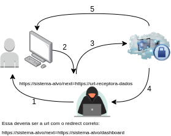
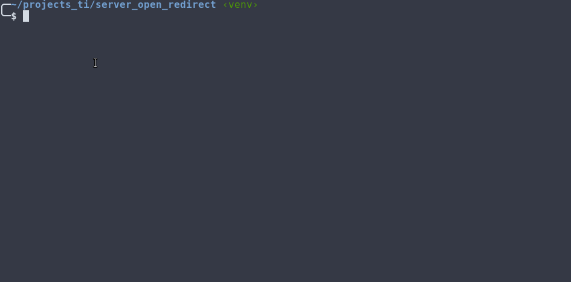

# Open Redirect Tester

**ATENÇÃO:** Uso da app tem objetivo educacional ou para utilizar em um pentest web autorizado.

Essa app automatiza a validação de um ataque usando Open Redirect. A app recebe os dados submetidos a partir de um formulário em um alvo e salva em um arquivo chamado dados.txt. Esse ataque envolve uma etapa prévia de envio de um link para o usuário alvo.

## Esquema teórico do ataque



Fonte da imagem do usuário malicioso (mage by macrovector_official on Freepik): [Link](https://www.freepik.com/free-vector/hacker-activity-set-black-red-icons-breaking-account-malware_16334214.htm#query=computer%20hacker&position=12&from_view=keyword&track=aisI)

Em alguns sistemas, no formulário de login, após o usuário informar os dados e submeter, na url já é passado um parâmetro que indica que após logar, o usuário será redirecionado para uma determinada url. Esse parâmetro pode ter vários nomes (redirect, next, service, etc).

Na figura anterior, como exemplo, a url indica que após logar o usuário deverá ser redirecionado para https://sistema-alvo/dashboard.

**Etapas do ataque**:

1. O atacante envia um link malicioso com um parâmetro de redirecionamento diferente, enviando os dados para um sistema malicioso;
2. O usuário vítima acessa o link e informa as credenciais de acesso;
3. As credenciais são enviados para uma app maliciosa que recebe esses dados;
4. Os dados coletados são salvos e o atacante tem acesso a essa informação.
5. A app maliciosa envia um redirect para a vítima para uma url do sistema verdadeiro, no exemplo, https://sistema-alvo

## Como usar essa app

1. Efetue o clone da app em um computador com S.O. Linux, que será o servidor que executara a app maliciosa:

```shell
git clone https://github.com/gutobrutus/open-redirect-tester.git
```

2. Acesse o diretório da app:

```shell
cd open-redirect-tester
```

3. Inicie um virtual env do python:
```shell
python3 -m venv venv
```

4. Instale as dependências:
```shell
pip install -r requirements
```

5. Execute a app:
```shell
python3 server.py
```


A app solicitará 3 argumentos:
- **HOST**: O host que coletará os dados do usuário, no caso, onde estará executando a app maliciosa.
- **PORTA**: Em que porta a app maliciosa irá escutar.
- **URL_REDIRECT**: Para qual URL a app maliciosa redirecionará a vítima, uma url válida do sistema que o usuário está usando.

## Comentários:

Apesar de ser uma vulnerabilidade bastante conhecida, por vezes, ainda é encontrada alguns sistemas web. Essa app aqui é apenas para apoiar e facilitar um pouco na exploração, além de auxiliar no entendimento do ataque.

## TODO

- Coletar o cookie do usuário e devolver no redirect o usuário logado, deixando o ataque mais sútil e despercebido. Requer uma vulnerabilidade de XSS.
- Persistir um log de acesso da app
- Criar um Dockerfile para utilizar em container a app
